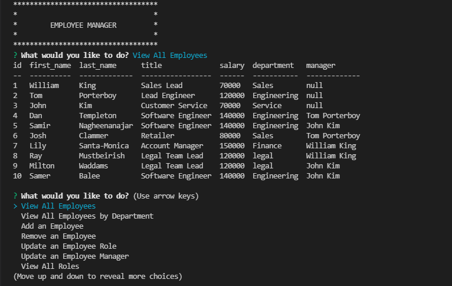

 # Employee-Tracker 

  ## Description

   A command-line application to manage a company's employee database, using Node.js, Inquirer, and MySQL.

  ## Tables of Contents
  * [Instalation](#instalation)
  * [Usage](#usage)
  * [Technologies](#technologies)
  * [License](#license)
  * [Contributing](#contributing)
  * [Tests](#tests)
  * [Questions](#questions)
   
  ## Instalation

   The user should clone the repository from GitHub. This application requires Node.js, Inquirer, console.table and mysql2. To start application run npm start. To view database from MySQL run mysql -u root -p.

  
  ## Usage
   This application will allow users to view, add, and edit employees, roles, departments, and managers.

  - Schema for related tables

    

  - Screenshot for terminal and exsample of viewing data

    
  
  ## Technologies

  - JavaScript                    
  - Git
  - NodeJs
  - MySQL
  - NPM

  ## License
   For information about this license visit: [MIT](https://opensource.org/licenses/MIT)

  ## Contributing
   No contribution needed.

  ## Tests
   No test nedded.

  ## Questions

  My GitHub link: [samer-balee](https://github.com/samer-balee)

  If you have any questions, please e-mail me at samerbalee@gmail.com